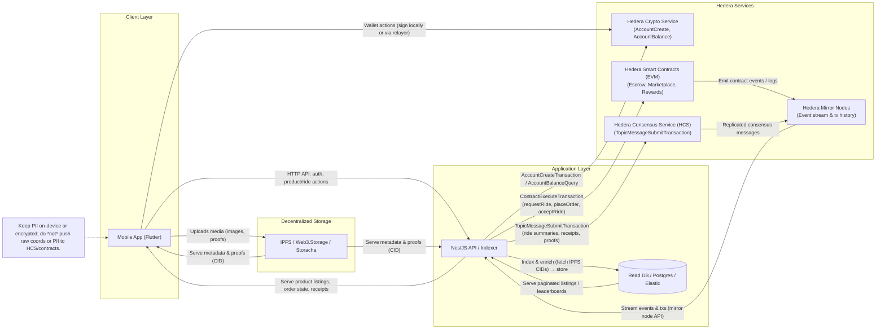
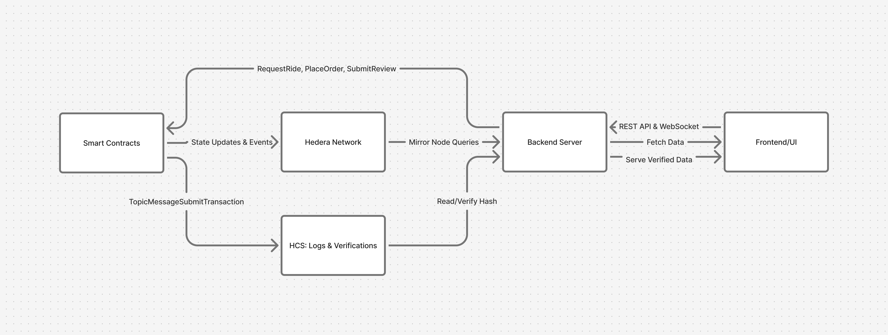

# Trekka Monorepo

Trekka is a decentralized geo playground built on Hedera Hashgraph. Riders and drivers exchange value directly while we keep their sensitive information off-chain, give them verifiable proofs on-chain, and move steadily toward a fully non-custodial experience. This repository contains the Flutter mobile client (privacy-intensive UX) and the NestJS API (privacy-sensitive coordination that should not live on the blockchain).

## Repository Layout

```
.
├─ packages/
│  ├─ trekka-mobile/     # Flutter client (logistics hailing, marketplace, quests)
│  ├─ trekka-api/        # NestJS backend (identity, payouts, verification)
│  └─ trekka-contracts/  # Hedera smart contracts (escrow, marketplace, rewards)
└─ scripts/            # Shared development helpers (dev runner, bootstrap, etc.)
```

### Docs & Pitch Materials

- [Pitch Deck](docs/pitch-deck.pdf)
- [Certification](docs/certificate.pdf)

## Architecture Snapshot (MVP/MLP)

- We are shipping an MVP/MLP: no CI/CD pipelines, background job runners, queues, or caches yet. The focus is on validating rider <> driver flows, escrow, and Hedera integrations.
- The Flutter app owns privacy-intensive logic (PII capture, local state, wallet UX). The API only processes privacy-sensitive data we cannot share publicly, then coordinates with Hedera services.
- Everything that benefits from public verifiability—escrow operations, settlement receipts, loyalty points, proof-of-ride images—lands on Hedera (Consensus, Smart Contract, or IPFS-backed storage).
- Short term goal: keep server state minimal; medium term goal: ship a fully non-custodial experience where users control their keys and data end to end.

### Product Surface Today

- **Logistics Hailing (development):** riders request transport, drivers accept rides, escrow settles automatically via Hedera smart contracts. Eco-friendly trips (EV fleets, early arrivals) earn green sustainability credits.
- **Marketplace (development):** peers list geo-tagged assets, services, and digital subscriptions (e.g., connectivity bundles, AI assistant seats). Each purchase emits a Hedera consensus receipt so buyers can audit transactions.
- **Recycling (coming soon):** collectors post availability, households schedule pickups, and payouts settle on-chain with proof of delivery. Verified recyclers mint sustainability credits as NFTs to redeem once the marketplace opens.
- **Quest — Physical (coming soon):** location-based missions reward users with on-chain points and collectible NFTs once DePIN signals (trusted hardware, Helium/beacon attestations) confirm presence without leaking raw location data.
- **Quest — Online (coming soon):** remote tasks (content, referrals, education) issue rewards tied to Hedera tokens so communities can verify completions asynchronously.
- **Logistics Courier (coming soon):** the mobility rails power parcel delivery with zero-custody hand-offs, notarized delivery proofs, and optional sustainability bonuses for eco routes.

### Sustainability & Incentive Layer

- **Green credits:** every recycler, eco-friendly driver, or energy-conscious quest participant mints a non-transferable credit NFT that can later be converted once the sustainability marketplace is live. Credits stack across all verticals to make greener choices tangible.
- **NFT utility:** collectibles celebrate milestones (first 100 sustainable rides, top marketplace sellers), unlock premium quests, and evolve with user reputation. We tie issuance to verifiable on-chain events so rewards stay scarce and meaningful.
- **DePIN integrations:** physical quests and courier proofs can rely on decentralized hardware (e.g., Helium, GPS beacons, secure sensors) to attest presence securely while keeping raw location private.
- **Receipt NFTs:** marketplace buyers can opt into an on-chain receipt NFT that mirrors the printable invoice. Metadata references a hashed order payload plus an encrypted IPFS proof, giving both auditability and a loyalty hook for future perks.

## 🧱 Trekka Architecture Diagram





## Privacy & Data Philosophy

- Sensitive personal data stays on the device; the API never stores more than it must for account recovery or regulatory obligations.
- Any logic that can be auditable runs on Hedera:
  - Escrow and ride lifecycle smart contracts guarantee payouts.
  - Consensus messages notarize trip summaries and receipts.
  - Reward points and badges map to on-chain state.
  - Proof artifacts are pinned to IPFS so riders can decide what is public.
- The API encrypts Hedera private keys with per-user additional authenticated data (AAD) and only decrypts inside secure server flows (`packages/trekka-api/src/wallets/wallets.service.ts:231`).

## Local Setup

### Prerequisites

- Node.js 20+ and npm (API)
- Flutter 3.22+ / Dart 3.4+ (mobile)
- Docker Desktop (for the Postgres + API stack)
- Git, a preferred IDE
- Hedera Testnet account + operator key (obtain from <https://portal.hedera.com>)

### Install Dependencies

```bash
git clone https://github.com/trekka-hq/trekka.git
cd trekka
./scripts/bootstrap.sh            # Installs npm dependencies and runs flutter pub get
```

### Configure Environment Variables

1. Copy the API example config and populate secrets:
   ```bash
   cd packages/trekka-api
   cp .env.example .env
   ```
2. Required values:
   - `HEDERA_OPERATOR_ID` / `HEDERA_OPERATOR_KEY` (from Hedera portal)
   - Database credentials (leave defaults for Docker: `trekka_postgres`)
   - JWT secrets, encryption key, mail + storage keys as needed
   - Generate a strong `ENCRYPTION_KEY` with `npm run generate:key` inside `packages/trekka-api`
3. Optional overrides exist for ports (`PORT`/`DB_PORT`) and seeded demo data.

## Running the Apps

### API with Docker Compose (recommended)

```bash
cd packages/trekka-api
docker compose up --build
```

The Compose stack now references `packages/trekka-api/Dockerfile.local`, which is scoped for local development so cloud platforms such as DigitalOcean App Platform ignore it and continue using their default build packs.

Make sure Docker Desktop (or your Docker daemon) is running before you run the command. The stack starts Postgres, applies Prisma migrations, seeds the demo driver wallet, and runs the NestJS server in watch mode on `http://localhost:3000`.

### API without Docker

```bash
cd packages/trekka-api
npm install
npm run prisma:generate
npm run prisma:migrate
npm run prisma:seed
npm run start:dev
```

Ensure your local Postgres instance matches `.env` settings.

### Mobile App

```bash
cd packages/trekka-mobile
flutter run --dart-define=API_BASE_URL=http://localhost:3000 --dart-define=USE_MOCKS=false
```

Flip `USE_MOCKS=true` to run entirely offline for demos.

### Combined Dev Runner

```bash
# from repo root
./scripts/dev.sh
```

This script spins up the Docker Compose API stack, waits for the server to respond, then launches the Flutter app. It stops the containers when you exit Flutter. Environment overrides:

```bash
API_BASE_URL=https://staging.api.trekka.app USE_MOCKS=false ./scripts/dev.sh
SKIP_DB_SEED=true ./scripts/dev.sh    # Skip Prisma seed if you already provisioned wallets
```

### Helpful Utilities

- `npm run generate:key` (inside `packages/trekka-api`) produces a 32-byte encryption key tailored for wallet AAD.
- `npm run hedera:create-topic -- "Optional memo"` provisions a new Hedera Consensus topic using the credentials in `.env`.
- `npm run prisma:studio` opens the Prisma data browser against your local database.

## Testing

### API

```bash
cd packages/trekka-api
npm run lint
npm run test
npm run test:e2e
npm run test:cov
```

### Mobile

```bash
cd packages/trekka-mobile
flutter analyze
flutter test
flutter test integration_test    # Requires device / emulator
```

## Hedera Integration

Trekka leans on multiple Hedera services to keep the platform trustless while respecting user privacy.

### Hedera Consensus Service (HCS)

- Purpose: append-only audit trail of ride life cycles, payouts, and upcoming marketplace receipts so regulators and riders can verify operations.
- Implementation: `HederaConsensusService` (`packages/trekka-api/src/hedera/consensus.service.ts`) submits structured JSON to `HEDERA_RIDE_SUMMARY_TOPIC_ID` via `TopicMessageSubmitTransaction`.
- Why Hedera: predictable ~$0.0001 per message and ~5 second finality give us tamper-evident proofs without exploding operating costs—a critical requirement for thin-margin mobility corridors in Africa.

### Hedera Smart Contract Service (EVM)

- Purpose: escrow fares, enforce ride state transitions, account for rewards, and eventually coordinate additional verticals (recycling, deliveries).
- Implementation: `WalletsService` (`packages/trekka-api/src/wallets/wallets.service.ts`) signs `ContractExecuteTransaction` calls (`requestRide`, `acceptRide`, `completeRide`, cancel variants) with user wallets, capping gas to 500k to avoid runaway costs.
- Why Hedera: predictable gas pricing (<$0.01) and finality backed by ABFT consensus let us automate escrow releases without exposing riders to chain congestion or speculative fees, which is essential for price-sensitive commuters.

### Hedera Account Service (Crypto)

- Purpose: provision non-custodial wallets per rider/driver, top them up, and expose balances to the mobile client.
- Implementation: during signup and database seeding we call `AccountCreateTransaction` to generate accounts, encrypt the private key with per-user AAD, and store the ciphertext (`packages/trekka-api/src/wallets/wallets.service.ts:152`, `packages/trekka-api/prisma/seed.ts:50`). `AccountBalanceQuery` keeps wallet balances fresh, and the mobile app signs its own transfers once we move to full non-custody.
- Why Hedera: account creation costs only a few cents and provides native HBAR support, letting us give every rider/driver a ledger-backed wallet from day one without running our own custody infrastructure.

### Decentralized Storage (IPFS + Storacha / Web3.Storage)

- Purpose: host proof artifacts (ride completion images, compliance docs) without leaking PII.
- Implementation: scaffolding under `packages/trekka-api/src/storage` will pin assets to IPFS-backed gateways using keys declared in `.env` (`S3_STORAGE_KEY`, `S3_STORAGE_PROOF`) once Storacha credentials are wired. Mobile clients decide which artifacts to publish.
- Why decentralized storage: content-addressed proofs give riders control over what becomes public, and Hedera contracts can reference the same CID for dispute resolution without us warehousing large binaries.

### Hedera Mirror Nodes

- Purpose: independent verification of on-chain actions (ride settlement receipts, consensus timestamps) for auditors, partners, and the mobile client.
- Implementation: downstream analytics services poll mirror-node APIs to materialize ride history dashboards and reconcile loyalty payouts (integration hooks live in upcoming reporting modules).
- Why Hedera: mirror nodes deliver the same ABFT-guaranteed data stream without us running consensus infrastructure, enabling transparent reporting at negligible cost.

### Deployment IDs (Testnet)

| Component         | Hedera ID     | Hedera EVM Address                       |
|-------------------|---------------|-------------------------------------------|
| EscrowManager     | `0.0.7167779` | `0x0404dF8365111b34C7Ec46C4805462b384E8B224` |
| ReputationSystem  | `0.0.7167780` | `0x71660Df400Cb33c3032234a71625738b4A283d39` |
| RideHailing       | `0.0.7167785` | `0x2B76D0F307EF754EF41741d2a6f3eAe4F6edc9CE` |
| Marketplace       | `0.0.7173124` | `0x0Aad7DCd751Bd24E2fADb4E563FAF29624076D40` |
| Ride summary topic| `0.0.7171590` | — |

Keep `.env` in sync with the latest contract/topic IDs before deploying a new build.

### Operational Cheatsheet

| Flow | Hedera API | Location & Purpose |
|------|------------|--------------------|
| Wallet provisioning | `AccountCreateTransaction`, encrypted key storage | `packages/trekka-api/src/wallets/wallets.service.ts:152` creates user wallets, stores ciphertext with AAD, and seeds initial balances. |
| Contract interactions | `ContractExecuteTransaction` (`requestRide`, `acceptRide`, `cancelRideByRider/Driver`, `completeRide`) | `packages/trekka-api/src/wallets/wallets.service.ts:109` signs transactions per wallet, enforces gas usage, and logs transaction IDs. |
| Balance telemetry | `AccountBalanceQuery` | `packages/trekka-api/src/wallets/wallets.service.ts:238` refreshes balances before returning wallet info. |
| Consensus logging | `TopicMessageSubmitTransaction` | `packages/trekka-api/src/hedera/consensus.service.ts:54` broadcasts ride summaries to HCS. |
| Demo provisioning | `AccountCreateTransaction` (seed script) | `packages/trekka-api/prisma/seed.ts:50` bootstraps a pioneer driver with 100 HBAR for dev/demo use. |
| Topic creation tooling | `TopicCreateTransaction` | `packages/trekka-api/scripts/create-consensus-topic.ts:1` CLI helper to mint new topics with your operator key. |

Every Hedera interaction requires valid credentials. Reuse the same operator account on testnet; production will rotate dedicated operators per service.

## Contributing

- Workflow: `main` (stable) ← `dev` (integration) ← feature branches (`feature/*`, `bugfix/*`, `hotfix/*`).
- Commits follow Conventional Commits with emoji prefixes (e.g., `🌍 feat: add quest feed`).
- See `CONTRIBUTING.md` for PR checklists, security notes, and the hackathon access policy.

## Support & Links

- Issues: <https://github.com/trekka-hq/trekka/issues>  
- Discussions: <https://github.com/trekka-hq/trekka/discussions>  
- Engineering: `dev@trekkaweb.com` • Security: `security@trekkaweb.com` • Product: `pm@trekkaweb.com`

## License

Proprietary — Internal/Invited Use Only. You may not fork, resell, package, or otherwise profit from this codebase without prior written permission. Refer to `CONTRIBUTING.md` for the hackathon access window and contributor obligations.
